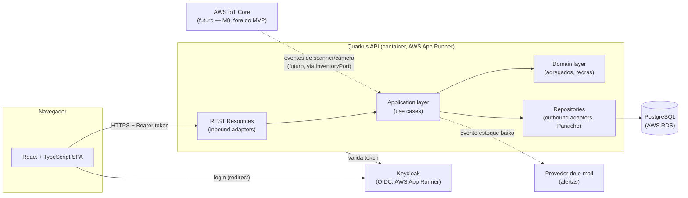

# 03 — Arquitetura

Status: **Aceito** · Última revisão: 2026-08-19 · Decisões detalhadas em `docs/adr/`.

## Visão geral



Infraestrutura provisionada em AWS via Terraform (ADR-0009); a caixa `IOT` é apenas direção
declarada (ver `00-vision.md`, "Visão de futuro" e `02-domain-model.md`), sem implementação no
MVP.

## Estilo arquitetural: monólito modular + hexagonal (ver ADR-0002)

Um único serviço deployável (`backend`), mas internamente organizado por **módulo de domínio**
(`catalog`, `partners`, `inventory`, `purchasing`, `sales`, `notifications`), e dentro de cada
módulo por **camada**:

```
backend/src/main/java/com/stockmaster/
  catalog/
    domain/          -> Product, regras, interfaces de repositório (portas)
    application/     -> use cases (ex: CreateProductUseCase), orquestra domínio + portas
    infrastructure/
      web/           -> REST resource (JAX-RS), DTOs de request/response
      persistence/   -> entidade Panache, implementação da porta de repositório
  inventory/
    domain/          -> StockBalance, StockMovement, regras de concorrência
    application/
    infrastructure/
  purchasing/
  sales/
  partners/
  notifications/
  shared/            -> tipos comuns (Money, Page<T>, exceções de domínio, ProblemDetails)
```

Regra: `domain` não importa nada de `infrastructure` nem de framework (sem anotações JPA/JAX-RS
na classe de domínio pura quando praticável; onde o Panache Active Record tornar isso custoso,
manter ao menos a **lógica de invariante** em métodos de domínio testáveis sem contexto Quarkus).
`application` depende de `domain` e de **interfaces** de porta, nunca da implementação concreta em
`infrastructure`. `purchasing`/`sales` dependem da porta pública de `inventory`
(`InventoryPort`), nunca do repositório interno de `inventory`.

Por que não microsserviços: o domínio é coeso e pequeno o bastante para não justificar a
complexidade operacional (deploy distribuído, consistência eventual entre serviços) — ver
ADR-0002 para a análise completa. Se o projeto crescer muito além do MVP, o corte por módulo já
deixa claro onde partir em serviços depois.

## Stack completa

### Backend

| Peça | Escolha | Motivo |
|---|---|---|
| Linguagem/runtime | Java 21 (LTS) | Virtual threads disponíveis, LTS |
| Framework | Quarkus 3.x | Startup rápido, DX moderna, nativo se necessário |
| Build | Maven | Padrão de mercado enterprise Java |
| Persistência | Hibernate ORM + Panache | Produtividade sem abrir mão de JPA puro quando preciso |
| Banco | PostgreSQL | Suporte robusto a `@Version`/locks, JSONB se necessário |
| Migrations | Flyway | Versionamento de schema auditável |
| Validação | Hibernate Validator (Bean Validation) | Padrão Jakarta EE |
| API docs | SmallRye OpenAPI + Swagger UI | Contract-first, gera client TS |
| AuthN/AuthZ | Quarkus OIDC + Keycloak | RBAC real, padrão de mercado |
| Observabilidade | Micrometer (Prometheus) + OpenTelemetry | Métricas + tracing distribuído |
| Logs | quarkus-logging-json | Logs estruturados, correlacionáveis por trace id |
| Testes | JUnit 5, RestAssured, Testcontainers | Unit + integração real (Postgres/Keycloak) |

### Frontend

| Peça | Escolha | Motivo |
|---|---|---|
| Framework | React 18 + TypeScript | Mais procurado em vagas sênior |
| Build | Vite | Rápido, padrão atual |
| Server state | TanStack Query | Cache/refetch declarativo, evita estado manual |
| Formulários | React Hook Form + Zod | Validação tipada compartilhável com schema |
| UI | Tailwind CSS + shadcn/ui | Componentes acessíveis, sem peso de lib fechada |
| Client de API | Gerado do OpenAPI (`openapi-typescript` + fetch wrapper) | Contrato nunca diverge |
| Auth | `keycloak-js` (Authorization Code + PKCE) | Integra direto com o IdP escolhido |
| Testes | Vitest + React Testing Library, Playwright (E2E) | Unit + fluxo real no navegador |

### Infra

| Peça | Escolha | Motivo |
|---|---|---|
| Dev local | Docker Compose (Postgres, Keycloak, backend, frontend) | Onboarding em um comando |
| CI | GitHub Actions | Build/test backend e frontend, gate de PR |
| IaC | Terraform | Infra AWS reprodutível a partir de código, revisável em PR |
| Deploy backend | AWS App Runner (container, a partir de imagem no ECR) | Container Quarkus, HTTPS/scale gerenciados, sem VPC manual |
| Banco | AWS RDS PostgreSQL (free tier) | Suporte robusto a `@Version`/locks; caminho de upgrade p/ Aurora Serverless v2 |
| Deploy Keycloak | Container próprio no AWS App Runner (mesma instância RDS, schema separado) | Reaproveita infra já provisionada, evita 2º banco pago |
| Deploy frontend | Vercel ou Netlify (estático) | CDN, preview deploys por PR; mantido fora da AWS de propósito (ver ADR-0009) |
| Segredos | AWS Secrets Manager / SSM Parameter Store | Nunca em variável de ambiente commitada (constituição, regra 8) |
| Custo | AWS Budgets com alerta + `terraform destroy` documentado | Projeto de portfólio não pode gerar conta surpresa |

Decisão completa, alternativas consideradas (Fly.io, Render, Cloud Run) e consequências em
**ADR-0009** (supersede ADR-0007).

## Cross-cutting concerns

- **Erros**: um `ExceptionMapper` global traduz exceções de domínio (`InsufficientStockException`,
  `InvalidStateTransitionException`, etc.) em `application/problem+json` com `type`, `title`,
  `status`, `detail`, `instance`. Exceções não mapeadas viram 500 genérico sem vazar stack trace.
- **Concorrência**: `StockBalance.version` (`@Version`) — conflito de escrita gera
  `OptimisticLockException` → mapeado para HTTP 409, frontend re-busca e permite retry explícito
  pelo usuário.
- **Idempotência**: endpoints de transição de estado (`receive`, `confirm`, `invoice`) verificam o
  estado atual antes de aplicar — chamar `RECEIVED` duas vezes no mesmo pedido é no-op na segunda
  vez (não duplica `StockMovement`).
- **Paginação**: todo endpoint de listagem usa `page`/`size` (offset) com limite máximo de `size`
  no servidor (RNF-5).
- **AuthZ por endpoint**: mapeamento em `docs/spec/04-api-contract.md`.

## Estratégia de testes (pirâmide)

1. **Unit (domínio puro)** — `StockBalance`, `SalesOrder`, `PurchaseOrder`: sem Quarkus, sem
   banco, JUnit puro. É aqui que as invariantes de `02-domain-model.md` são verificadas.
2. **Component/use case** — application layer com portas mockadas (Mockito), garante orquestração
   correta (ex: `ConfirmSalesOrderUseCase` chama `reserve` para cada linha e reverte tudo se uma
   falhar).
3. **Integração** — `@QuarkusTest` + Testcontainers (Postgres real, Keycloak real via
   `quarkus-test-keycloak-server` ou Testcontainers Keycloak): fluxo completo compra→estoque e
   venda→estoque, incluindo teste de concorrência (duas threads confirmando o mesmo pedido).
4. **Contrato** — RestAssured validando resposta contra o schema OpenAPI publicado.
5. **Frontend unit** — Vitest + Testing Library nos componentes/hooks críticos.
6. **E2E** — Playwright cobrindo o caminho feliz completo (login → criar produto → criar
   compra → receber → criar venda → confirmar → faturar → ver saldo atualizado).

## Observabilidade

- Métricas de negócio expostas via Micrometer (ex: contador de `stock_movements_total{type=...}`,
  gauge de `low_stock_products`).
- Tracing distribuído (OpenTelemetry) do request HTTP até a query SQL — útil para depurar
  contenção de concorrência em produção.
- Logs em JSON com `traceId`/`spanId` correlacionados automaticamente pelo Quarkus.
- Em produção (AWS), logs/métricas/traces são coletados via App Runner → CloudWatch Logs por
  padrão; ADOT (AWS Distro for OpenTelemetry) como evolução para enviar traces a X-Ray, se o
  tempo do projeto permitir (não bloqueia M6 — ver roadmap).

## Segurança

- Papéis Keycloak → permissões (detalhe endpoint a endpoint em `04-api-contract.md`):
  `ADMIN` (tudo), `ESTOQUISTA` (estoque + recebimento de compra), `VENDEDOR` (pedidos de venda),
  `GESTOR` (somente leitura/relatórios).
- Tokens validados via `quarkus-oidc` (JWT assinado pelo Keycloak, `issuer` configurado por env).
- CORS restrito à origem do frontend em produção.
